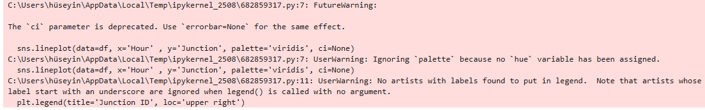

# Smart-City-Traffic-Analysis-Scalable-Data-Pipeline-Architecture

### *Infrastructure Insights for Parsons Technology & Innovation Team*

This project demonstrates an end-to-end data engineering workflow designed for smart city infrastructure. It focuses on ingesting, cleaning, and visualizing high-frequency traffic sensor data to optimize junction efficiency and urban planning.

---

## 🏗️ Technical Architecture (Azure-Ready Design)
Although developed in a local Python environment, the logic follows the **Azure Medallion Architecture** to ensure scalability:

1. **Ingestion (Bronze):** Raw sensor data containing `DateTime`, `Junction`, and `Vehicle` counts.
2. **Transformation (Silver):** Data cleaning using **Pandas** (simulating **Azure Databricks/PySpark** logic). This includes feature engineering of temporal attributes (Hour, Day of Week).
3. **Aggregated Insights (Gold):** Final analytical views created to identify peak traffic hours and junction bottlenecks.

---

## 🚀 Key Engineering Features
* **Time-Series Processing:** Converted raw strings into high-performance `datetime64` objects for efficient indexing.
* **Temporal Feature Engineering:** Extracted hour-of-day and day-of-week metrics to reveal cyclical urban patterns.
* **Data Quality Assurance:** Implemented rigorous deduplication and outlier filtering to ensure pipeline integrity.
* **Visual Intelligence:** Developed multi-variate line charts to compare traffic volume across different city junctions.

---

## 📊 Analytical Results
The following visualization identifies critical peak periods (Morning and Evening peaks) across various junctions, providing a foundation for real-time traffic signal optimization.

*(Note: Upload your latest traffic graph here)*

---

## 🛠️ Tech Stack & Skills
* **Programming:** Python (Pandas, Matplotlib, Seaborn)
* **Concepts:** Data Engineering Pipelines, Time-Series Analysis, ETL/ELT
* **Cloud Alignment:** Designed with **Microsoft Azure (Databricks & Data Factory)** implementation standards in mind.

---

## 💡 Why Parsons?
My goal is to transition from data analysis to high-performance data engineering. This project reflects my ability to handle the types of data Parsons processes for large-scale infrastructure programs. I am eager to apply this foundation to enterprise-grade tools like **Azure Synapse** and **Apache Spark** within your Technology and Innovation team.

---

## 📫 Contact
**Hüseyin** – *Graduate Data Engineer Candidate*
[LinkedIn Profile Link] | [GitHub Portfolio]
